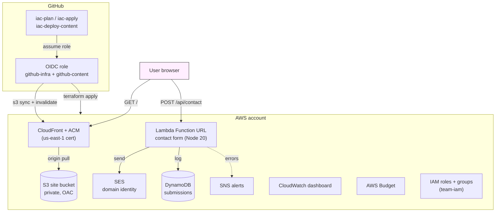

# aws-edge

The original AWS implementation of this multi-cloud Terraform templates
repo. CloudFront + S3 + ACM for static sites, Lambda + SES + DynamoDB
for per-site contact forms, IAM groups + OIDC roles for CI/CD, and an
ops baseline (CloudWatch dashboard, AWS Budget, SNS alerts).

> Repo-wide overview and contributor docs live one level up at
> [`/README.md`](../README.md) and [`/ARCHITECTURE.md`](../ARCHITECTURE.md).
> Everything below is scoped to AWS.

[](../../LICENSE)
[](https://www.terraform.io/)

## What you get

- **Multi-site, multi-environment** — directory-based envs (`envs/<env>/`),
  file-per-site, copy a working env to add another in one command
- **Static sites on AWS** — CloudFront + S3 (private, OAC) + ACM (us-east-1)
- **Per-site contact form** — Lambda + SES + DynamoDB, Cloudflare Turnstile
  optional
- **OIDC-only CI/CD** — no long-lived AWS keys, GitHub Environments map 1:1
  to folders
- **Safe teardown** — `scripts/teardown-env.sh` empties S3, destroys, and
  cleans up state in one command (with confirmation)
- **Ops baseline** — CloudWatch dashboard, AWS Budget, SNS alerts

## Getting started

New here? Follow the **[step-by-step walkthrough →](GETTING_STARTED.md)**
from template fork to deployed site with CI/CD running.

Already been through it once? The sections below are your reference
for day-to-day operations.

## Layout

```
bootstrap/                       S3 + DynamoDB state backend (one-time per AWS account)
modules/
├── static-site/                CloudFront + S3 (private, OAC) + ACM in us-east-1;
│                               optional www → apex redirect via CloudFront Function;
│                               custom 404 page
├── contact-form/               Lambda (Node 20, SES + DynamoDB);
│                               Function URL (public, CORS locked to site domain);
│                               DynamoDB submissions table;
│                               CloudWatch log group + error alarm;
│                               optional Cloudflare Turnstile
└── team-iam/                   IAM groups (admin/developer/tester);
                                IAM users from team_members variable;
                                password policy + MFA enforcement;
                                OIDC roles for GitHub Actions (per-env)
envs/<env>/                     Per-environment stacks (envs/prod ships by default).
                                Wires the modules together;
                                declares the SES domain identity (one per env);
                                SNS alerts + email subscription;
                                CloudWatch dashboard;
                                AWS Budget
scripts/                        Helper shell scripts
.github/workflows/              CI/CD pipelines (OIDC, env-aware)
```

## Architecture

What runs in AWS, what runs in GitHub, and how traffic + deploys flow.

## Expandable capabilities

### Environments

Each env is a self-contained directory under `envs/<env>/` with its own
state file (`envs/<env>/terraform.tfstate` inside the shared S3 backend)
and its own set of sites.

**Add a new environment:**

```bash
./scripts/replicate-env.sh <env-name>
cd envs/<env-name>
cp terraform.tfvars.example terraform.tfvars
$EDITOR terraform.tfvars   # your values
terraform init
terraform plan
terraform apply
```

The `replicate-env.sh` script copies the `prod/` directory, so your new
env inherits all the same module structure. You can then customize the
variables (domain, region, sites, team members, etc.).

**CI/CD for new environments:**

Each env needs its own GitHub Environment and OIDC role secrets. See the
[CI/CD setup guide](GETTING_STARTED.md#step-7--set-up-cicd) in the
walkthrough.

---

### Sites

A site is a domain + optional contact form. Sites are controlled by the
`sites` map in `terraform.tfvars` and file-per-site config under
`sites/`.

**Enable a new site:**

1. Create a site config file. The `envs/prod/sites/` directory ships with
   three underscore-prefixed examples you can copy and rename:

   - `_example-com.tf` — apex marketing site (`www` redirect enabled,
     contact form enabled by default).
   - `_app-example-com.tf` — subdomain site (`app.example.com`) with the
     contact form enabled.
   - `_blogs-example-com.tf` — subdomain site (`blogs.example.com`) with
     the contact form disabled by default.

   ```bash
   cp sites/_example-com.tf sites/my-site.tf
   # edit the domain in sites/my-site.tf
   ```
2. Add an entry to the `sites` map in `terraform.tfvars`:
   ```hcl
   sites = {
     # existing entries...
     my-site = {
       domain = "mysite.example.com"
     }
   }
   ```
3. Create a content directory:
   ```bash
   mkdir -p envs/prod/content/my-site/dist
   # place your built files there
   ```
4. Run `terraform plan` and `terraform apply`.
5. Add the DNS records (ACM validation CNAME + site CNAME) from
   `terraform output sites`.
6. Deploy content:
   ```bash
   ./scripts/deploy-site.sh prod my-site ./envs/prod/content/my-site/dist
   ```

**Disable a site:** remove the entry from the `sites` map and run
`terraform apply` to destroy its resources.

**Underscore-prefix convention:** files named `_<name>.tf` are ignored
by Terraform. This lets you keep disabled site configs in version
control. Rename `_my-site.tf` → `my-site.tf` to enable.

---

### Contact forms

Contact forms are per-site and enabled by default. To disable for a
specific site:

```hcl
sites = {
  my-site = {
    domain              = "mysite.example.com"
    enable_contact_form = false
  }
}
```

Each enabled site gets:
- Lambda function (Node 20) with Function URL
- SES email sending (verify the DKIM CNAMEs first)
- DynamoDB submissions table
- CloudWatch log group + error alarm
- Cloudflare Turnstile (optional — set `turnstile_secret`)

To add a new contact-form site, just leave `enable_contact_form` as the
default `true` and make sure `recipient_email` is set per-site or
`alert_email` is set as fallback.



## Add a new environment

```bash
./scripts/replicate-env.sh stage
# then edit envs/stage/terraform.tfvars, init, plan, apply
```

## Tear down an environment

```bash
./scripts/teardown-env.sh stage
./scripts/teardown-env.sh prod --force   # requires explicit --force for prod
```

## Known issues

The original implementation is the source of the multi-cloud split. An
audit from 2026-06-22 identified 11 real bugs and several AI-tell issues
that have **not** been fixed in this pass. The cleaner pattern lives at
[`/az-swa/`](../az-swa/) — when adding a new cloud, copy from there, not
from here.

## License

[MIT](../../LICENSE). No warranty; you own what you ship.

## Contributing

See [`CONTRIBUTING.md`](../../CONTRIBUTING.md). Bug reports and feature
requests: use the issue templates in `.github/ISSUE_TEMPLATE/`.