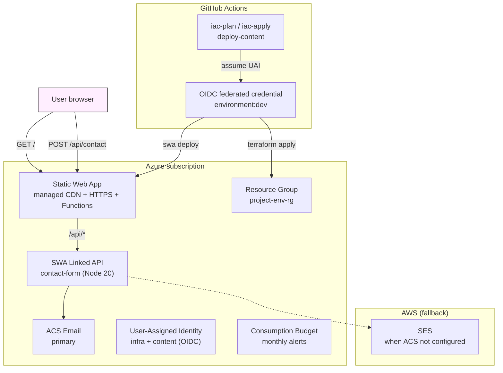

# az-swa

Azure Static Web Apps implementation. **This folder is also the
reference pattern** for adding new clouds to this repo — when you add
another cloud, copy this shape, swap the provider, and rename modules
to match your cloud's primitives.

> Repo-wide overview and conventions live one level up at
> [`/README.md`](../README.md) and [`/ARCHITECTURE.md`](../ARCHITECTURE.md).
> Everything below is scoped to Azure.

## What you get

- Static sites on **Azure Static Web Apps** (Free tier — managed CDN,
  managed HTTPS, managed Functions).
- Per-site contact form as a SWA API with **ACS Email primary, AWS SES
  fallback**.
- **OIDC-only CI/CD** via user-assigned identities + federated
  credentials (no Azure client secrets in GitHub).
- Self-service envs (`envs/dev/` ships by default; copy to add another).
- Safe teardown with confirmation.

## Layout

```
az-swa/
├── bootstrap/                       state backend (storage account + container)
├── modules/
│   ├── static-hosting/              SWA + custom domain
│   ├── workload-identity/           UAI + federated credentials + role assignments
│   └── contact-form/                function code + app settings
├── envs/<env>/                      wires modules for one env
├── scripts/                         deploy / verify / teardown
├── content/<env>/<site>/dist/       static content (place your build output here)
└── .github/workflows/               CI/CD (plan, apply, deploy-content)
```

## Architecture

What runs in Azure, what runs in GitHub, and how traffic + deploys flow.

## Expandable capabilities

### Environments

Each env is a self-contained directory under `envs/<env>/` with its own
state file and its own `sites` map.

**Add a new environment:**

```bash
cp -r envs/dev envs/<env-name>
cd envs/<env-name>
$EDITOR terraform.tfvars    # update domain, env name, sites
terraform init
terraform plan
terraform apply
```

**Notes on new environments:**
- The backend block in `envs/<env>/main.tf` is hardcoded — update
  the `key` to include the env name (e.g. `az-swa/envs/stage/terraform.tfstate`).
- Each env needs its own GitHub Environment, federated credentials, and
  secrets. Follow the [CI/CD setup steps](GETTING_STARTED.md#step-5--set-up-cicd)
  from the walkthrough for each new env.
- The `deploy/azure` branch triggers all CI/CD — if you want separate
  branches per env, you can extend the workflow triggers.

---

### Sites

Sites are entries in the `sites` map inside `terraform.tfvars`.

**Add a site:**

1. Add an entry to `terraform.tfvars`:
   ```hcl
   sites = {
     # existing entries...
     new-site = {
       domain = "new-site.example.com"
     }
   }
   ```
2. Create a content directory:
   ```bash
   mkdir -p content/dev/new-site/dist
   # place your built files there
   ```
3. Run `terraform plan` and `terraform apply`.
4. Add the DNS CNAME from your domain to the SWA hostname.
5. Deploy content:
   ```bash
   ./scripts/deploy-site.sh --env dev new-site
   ```

**Disable a site:** remove the entry from the `sites` map and run
`terraform apply` to destroy its resources.

---

### Contact forms

Contact forms are per-site SWA API endpoints. Enabled by default.

To disable for a specific site:

```hcl
sites = {
  my-site = {
    domain              = "mysite.example.com"
    enable_contact_form = false
  }
}
```

Each enabled form uses **ACS Email** as the primary email provider.
If ACS is not configured (`acs_connection_string` is empty), it falls
back to **AWS SES** (requires `ses_access_key`, `ses_secret_key`, and
`ses_region`).

**To enable email sending:**
- For ACS: set `acs_connection_string` in your tfvars (retrieve from
  the Azure portal after bootstrap)
- For SES fallback: set `ses_access_key`, `ses_secret_key`, `ses_region`
  (AWS IAM user with SES send permissions)



## Getting started

New here? Follow the **[step-by-step walkthrough →](GETTING_STARTED.md)**
from template fork to deployed site with CI/CD running.

Already been through it once? The sections below are your reference
for day-to-day operations.

## CI/CD

Three workflows live at `az-swa/.github/workflows/`:

| Workflow | Triggers on | Does |
|---|---|---|
| `az-swa-iac-plan.yml` | PR touching `az-swa/envs/**`, `az-swa/modules/**`, or the workflow files | `fmt -check`, `validate`, `plan` against the dev env |
| `az-swa-iac-apply.yml` | Push to `deploy/azure` touching `az-swa/envs/**` or `az-swa/modules/**` (or `workflow_dispatch`) | `terraform apply -auto-approve` on dev, gated by GitHub Environment `dev` |
| `az-swa-deploy-content.yml` | Push to `deploy/azure` touching `az-swa/content/dev/**` | matrix over changed sites, calls `./az-swa/scripts/deploy-site.sh --env dev <site>` |

OIDC trust: the federated credentials created by the
`workload-identity` module match `repo:<org>/<repo>:environment:dev`,
which is what GitHub sends in the OIDC subject claim when a workflow
runs in the `dev` GitHub Environment. The Environment name in the
GitHub UI must be exactly `dev`.

Secrets consumed (set in `gh secret set … --repo <org>/<repo>`):

- `AZ_SWA_DEV_INFRA_CLIENT_ID` — used by plan + apply (terraform apply role)
- `AZ_SWA_DEV_CONTENT_CLIENT_ID` — used by deploy-content (SWA deploy role)
- `AZ_SWA_DEV_TENANT_ID` — Azure AD tenant
- `AZ_SWA_DEV_SUBSCRIPTION_ID` — Azure subscription
- `AZ_SWA_DEV_TFVARS` — contents of `envs/dev/terraform.tfvars`

## Add a new environment

```bash
cp -r envs/dev envs/stage
$EDITOR envs/stage/terraform.tfvars
cd envs/stage && terraform init && terraform apply
```

## Tear down an environment

```bash
./scripts/teardown-env.sh dev     # refuses prod
```

## Cost (low traffic)

| Service | Monthly |
|---|---|
| Static Web Apps (Free tier) | $0 |
| Communication Service (ACS Email, usage-based) | ~$0 |
| Consumption budget alert | — |
| **Total** | **~$0** |

## Adapting this pattern to another cloud

1. Copy this folder, rename it to your cloud (`gcp-cdn/`, `oci-edge/`, …).
2. Replace the provider in `bootstrap/`, `modules/`, and `envs/<env>/`.
3. Rename modules to match your cloud's primitive names
   (`static-hosting` → whatever your cloud calls it, e.g. `cloudfront-cdn`
   for AWS, `cloud-cdn` for GCP).
4. Replace `scripts/` with your cloud's native deploy/verify/teardown.
5. Add `<cloud>/.github/workflows/` modeled on
   `az-swa/.github/workflows/` (Azure example) or `aws-edge/.github/workflows/`
   (AWS example).
6. Add a row to the table in `/README.md`.

Keep the **shape** (bootstrap → modules → envs → scripts), keep
OIDC-only CI/CD, keep directory-based envs. The specifics inside each
folder are cloud-native; the conventions between folders are the
template.