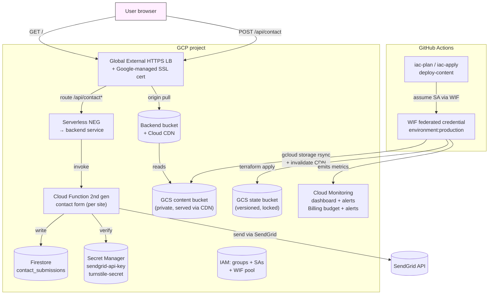

# gcp-edge

GCP implementation of this multi-cloud Terraform templates repo.
Host static websites on **Google Cloud Storage + Cloud CDN** behind a
**Global External HTTPS Load Balancer**, with per-site contact forms
(Cloud Functions 2nd gen + SendGrid + Turnstile), budget alerts,
monitoring dashboard, and CI/CD via **Workload Identity Federation**.

> Repo-wide overview and contributor docs live one level up at
> [`/README.md`](../README.md) and [`/ARCHITECTURE.md`](../ARCHITECTURE.md).
> Everything below is scoped to GCP.

[](../../LICENSE)
[](https://www.terraform.io/)

## What you get

- **Multi-site, multi-environment** — directory-based envs (`envs/<env>/`),
  copy a working env to add another in one command
- **Static sites on GCP** — Cloud CDN + backend buckets + GCS (private
  origins); Google-managed SSL certificates; apex → www redirect via
  URL map
- **Per-site contact form** — Cloud Functions 2nd gen (Node 20) +
  SendGrid + Cloudflare Turnstile + Firestore for submission records
- **OIDC-only CI/CD** — no long-lived GCP service account keys; GitHub
  Environments map 1:1 to folders; Workload Identity Federation for
  short-lived credentials
- **Safe teardown** — `scripts/teardown-env.sh` empties buckets,
  destroys, and cleans up state in one command (with confirmation)
- **Ops baseline** — Cloud Monitoring dashboard (LB requests, CF errors,
  Firestore writes), billing budget with 50%/90%/100% email alerts
- **Team IAM** — three Cloud Identity groups (`<project>-admins`,
  `<project>-developers`, `<project>-readonly`) bound to project roles

## Getting started

New here? Follow the **[step-by-step walkthrough →](GETTING_STARTED.md)**
from template fork to deployed site with CI/CD running.

Already been through it once? The sections below are your reference
for day-to-day operations.

## Layout

```
gcp-edge/
├── bootstrap/                       GCS state bucket + enable APIs (one-time per project)
├── modules/
│   ├── static-site-cdn/             GCS (private) + backend bucket + Cloud CDN + 404/500
│   ├── contact-form-fn/             CF 2nd gen (Node 20) + serverless NEG + backend svc
│   │                                + monitoring alert policy;
│   │                                SendGrid + Turnstile optional
│   ├── team-iam/                    Cloud Identity group bindings + service accounts
│   │                                + Workload Identity Federation pool + OIDC provider
│   └── ops/                         Billing budget + Cloud Monitoring dashboard
├── envs/<env>/                      Per-environment stacks (envs/prod ships by default).
│                                    Wires the modules together;
│                                    declares the global LB + managed cert + URL map;
│                                    creates the Firestore DB, function-source bucket,
│                                    and Secret Manager secrets
├── scripts/                         Helper shell scripts
├── content/<env>/<site>/dist/       Static content (placeholders ship)
└── .github/workflows/               CI/CD pipelines (WIF, env-aware)
```

## Architecture

What runs in GCP, what runs in GitHub, and how traffic + deploys flow.



## Expandable capabilities

### Environments

Each env is a self-contained directory under `envs/<env>/` with its own
state file (a `prefix` under the shared GCS backend) and its own set of
sites.

**Add a new environment:**

```bash
./scripts/replicate-env.sh prod stage stage.example.com
cd envs/stage
# edit terraform.tfvars (regions, domains, etc.)
terraform init
terraform plan
terraform apply
```

The script copies `envs/prod/`, rewrites the backend `prefix` to
`gcp-edge/envs/stage`, generates a `terraform.tfvars` trimmed for
non-prod (lower budget, env-specific sites), and creates placeholder
content under `content/stage/<site>/dist/`.

**CI/CD for new environments:**

Each env needs its own GitHub Environment, WIF provider binding, and
secrets. See the [CI/CD setup guide](GETTING_STARTED.md#step-7--set-up-cicd)
in the walkthrough.

---

### Sites

A site is a domain + optional contact form. Sites are controlled by the
`sites` map in `terraform.tfvars`.

**Enable a new site:**

1. Add an entry to the `sites` map in `terraform.tfvars`:
   ```hcl
   sites = {
     # existing entries...
     docs_example_com = {
       domain              = "docs.example.com"
       enable_www_redirect = false
     }
   }
   ```
2. Create a content directory:
   ```bash
   mkdir -p content/prod/docs_example_com/dist
   # place your built files there
   ```
3. Run `terraform plan` and `terraform apply`. The managed SSL cert is
   re-created to include the new domain; wait for it to provision
   (status `ACTIVE` in the GCP console).
4. Add a CNAME at your DNS provider: `docs` → `@`
5. Deploy content:
   ```bash
   ./scripts/deploy-site.sh --env prod docs_example_com
   ```

**Disable a site:** remove the entry from the `sites` map and run
`terraform apply` to destroy its resources.

---

### Contact forms

Contact forms are per-site and enabled by default. To disable for a
specific site, set `enable_contact_form = false` in the env's
`variables.tf` — this stops creating any `/api/contact*` routes, Cloud
Functions, Firestore writes, or SendGrid secrets.

Each enabled site gets:
- Cloud Function 2nd gen (Node 20) wired to a serverless NEG +
  backend service
- Route from `/api/contact*` on the LB to that backend service
- Firestore submission record (with IP-hash, Turnstile-verified flag)
- SendGrid outbound email to the configured recipient
- Secret Manager secrets for the SendGrid API key + Turnstile secret
- Cloud Monitoring alert for function errors

To skip email sending, leave the `sendgrid_secret_id` empty in the
module call (the function still receives POSTs but won't send). To skip
captcha, leave `turnstile_secret_id` empty.

---

## Add a new environment

```bash
./scripts/replicate-env.sh prod stage stage.example.com
# edit envs/stage/terraform.tfvars, init, plan, apply
```

## Tear down an environment

```bash
./scripts/teardown-env.sh stage    # refuses prod
```

The script:
1. Empties each site's GCS bucket (otherwise `terraform destroy` fails)
2. Runs `terraform destroy` in `envs/<env>/`
3. Deletes the per-env state prefix from the GCS backend
4. Prints manual cleanup steps — DNS records at your provider, and
   optionally `rm -rf envs/<env>` and `content/<env>`

## Cost (low traffic)

| Resource | Monthly (USD) |
|---|---|
| Global anycast IP | ~$3.50 |
| GCS storage (~10 MB content) | ~$0.00 |
| Cloud CDN (1 GB egress) | ~$0.12 |
| Cloud Functions 2nd gen (1K invocations) | ~$0.00 |
| Firestore (~1 MB) | ~$0.00 |
| Secret Manager (2 secrets × 3 versions) | ~$0.18 |
| Cloud Logging / Monitoring | ~$0 (free tier) |
| State bucket (~50 MB) | ~$0.00 |
| **Total** | **~$4/mo** |

Budget alert fires at 50% / 90% / 100% of `monthly_budget_limit_usd`
(default `$5`).

## License

[MIT](../../LICENSE). No warranty; you own what you ship.

## Contributing

See [`CONTRIBUTING.md`](../../CONTRIBUTING.md).